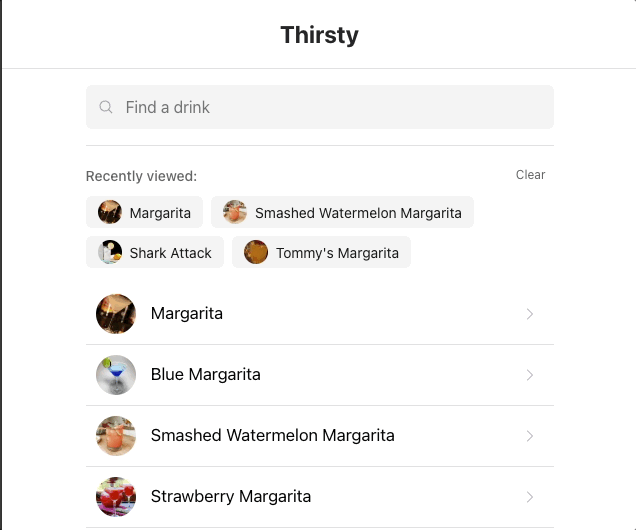

# Spiral - Thirsty - Drink Finder App

<div align="center">
  
</div>

A Next.js application for finding and displaying cocktail recipes, built as part of Spiral's take-home coding challenge.

## Live Demo

🚀 **Try it out**: [https://spiral-thirsty.vercel.app/](https://spiral-thirsty.vercel.app/)

## Tech Stack

- **Next.js 14** (App Router)
- **TypeScript** (strict mode)
- **React 18**
- **Chakra UI** (UI components)
- **@tanstack/react-query** (data fetching)
- **Vitest** (unit/integration testing)
- **Playwright** (E2E testing)
- **Prettier** (code formatting)
- **Husky** (Git hooks)
- **ESLint** (Linting)

## Prerequisites

- **Node.js** 18+ (latest LTS recommended)
- **npm** or **pnpm** (package manager)
  - npm comes with Node.js
  - To install pnpm: `npm install -g pnpm`

## Quick Start

1. **Clone the repository**:

   ```bash
   git clone <repository-url>
   cd spiral-thirsty
   ```

2. **Install dependencies**:

   ```bash
   npm install
   # or
   pnpm install
   ```

3. **Run the development server**:

   ```bash
   npm run dev
   # or
   pnpm run dev
   ```

4. **Open your browser**:
   Navigate to [http://localhost:3000](http://localhost:3000)

## Local Testing Setup

### Prerequisites for Testing

1. **Install Playwright browsers** (required for E2E tests):

   ```bash
   npm exec playwright install chromium
   # or
   pnpm exec playwright install chromium
   ```

   This only needs to be done once after cloning the repository.

### Running Tests Locally

#### Unit/Integration Tests (Vitest)

```bash
# Watch mode (development) - runs tests on file changes
npm run test
# or
pnpm run test

# Run tests once (for CI/pre-commit)
npm run test:run
# or
pnpm run test:run

# Run tests with UI (interactive)
npm run test:ui
# or
pnpm run test:ui
```

**Test Files:**

- `src/tests/api.test.ts` - API integration tests (currently skipped by default to avoid API rate limiting)

**Note:** API tests are skipped by default (`describe.skip`) to prevent rate limiting during development. To run them, remove `.skip` from the test file.

#### E2E Tests (Playwright)

```bash
# Run E2E tests headless (automatically starts dev server)
npm run test:e2e
# or
pnpm run test:e2e

# Run E2E tests with UI (interactive)
npm run test:e2e:ui
# or
pnpm run test:e2e:ui
```

**Test Files:**

- `e2e/home.spec.ts` - Home page tests
- `e2e/search-and-navigation.spec.ts` - Search and navigation tests
- `e2e/viewed-drinks-and-search.spec.ts` - Viewed drinks and search functionality tests

**Note:** Playwright automatically starts the dev server before running tests. Make sure port 3000 is available.

### Running All Tests

```bash
# Run both unit and E2E tests
npm run test:run && npm run test:e2e
# or
pnpm run test:run && pnpm run test:e2e
```

### Test Coverage

**Unit/Integration Tests:**

- ✅ API integration tests (`src/tests/api.test.ts`)
  - `searchDrinks` function
  - `getDrinkById` function
  - Helper functions and type guards
  - Response structure validation
  - Edge case handling

**E2E Tests:**

- ✅ Home page rendering
- ✅ Search functionality
- ✅ Navigation to detail pages
- ✅ Viewed drinks tracking
- ✅ Search history

### Troubleshooting Tests

**Issue: Port 3000 already in use**

```bash
# Kill process on port 3000 (macOS/Linux)
lsof -ti:3000 | xargs kill -9

# Or change port in package.json dev script
```

**Issue: Playwright browsers not installed**

```bash
npm exec playwright install chromium
```

**Issue: Tests failing due to API rate limiting**

- API tests are skipped by default
- E2E tests use the local dev server, not the API directly
- If you need to run API tests, ensure you're not hitting rate limits

**Issue: Tests timing out**

- Ensure dev server starts successfully
- Check network connectivity
- Increase timeout in `playwright.config.ts` if needed

## Available Scripts

### Development

- `npm run dev` - Start development server on http://localhost:3000
- `npm run build` - Build for production
- `npm run start` - Start production server (run `build` first)

### Code Quality

- `npm run lint` - Run ESLint to check for code issues
- `npm run format` - Format all files with Prettier
- `npm run format:check` - Check formatting without modifying files

### Testing

- `npm run test` - Run unit/integration tests in watch mode (Vitest)
- `npm run test:ui` - Run tests with Vitest UI (interactive)
- `npm run test:run` - Run tests once (for CI/pre-commit)
- `npm run test:e2e` - Run Playwright E2E tests (headless)
- `npm run test:e2e:ui` - Run Playwright tests with UI (interactive)

**Note:** Replace `npm` with `pnpm` if using pnpm as your package manager.

## Git Hooks (Husky)

This project uses Husky to run quality checks before commits. The pre-commit hook will automatically:

1. **Format code** - Run Prettier on staged files
2. **Lint code** - Run ESLint checks
3. **Run unit tests** - If test files changed (`.test.ts`, `.spec.ts`, or files in `e2e/` or `src/tests/`)
4. **Run E2E tests** - If code files changed (app, src, components, etc.)

All checks must pass before a commit is allowed. This ensures code quality, consistent formatting, and that all tests pass before code is committed.

**To bypass the hook (not recommended):**

```bash
git commit --no-verify
```

**Note:** On first clone, Husky hooks need to be set up:

```bash
npm run prepare
# or
pnpm run prepare
```

## Testing Details

### Unit/Integration Tests (Vitest)

Unit and integration tests are located in `src/tests/` and use Vitest.

**Current test coverage:**

- API integration tests (`src/tests/api.test.ts`) - 20 tests covering:
  - `searchDrinks` function
  - `getDrinkById` function
  - Helper functions and type guards
  - Response structure validation
  - Edge case handling

**Note:** API tests are skipped by default (`describe.skip`) to prevent API rate limiting. To run them, remove `.skip` from the test file.

### E2E Tests (Playwright)

E2E tests are located in the `e2e/` directory and use Playwright.

**Test Coverage:**

- Home page rendering and initial state
- Search functionality and results display
- Navigation to drink detail pages
- Viewed drinks tracking and display
- Search history functionality

**Setup** (first time only):

```bash
# Install Playwright browsers
npm exec playwright install chromium
# or
pnpm exec playwright install chromium
```

The Playwright configuration automatically starts the dev server before running tests, so you don't need to run `npm run dev` separately.

## Project Structure

```
spiral-thirsty/
├── app/                           # Next.js app directory (App Router)
│   ├── layout.tsx                # Root layout with providers
│   ├── page.tsx                  # Home/search page
│   └── drinks/
│       └── [id]/
│           └── page.tsx          # Drink detail page
├── src/
│   ├── components/               # React components
│   │   ├── common/              # Shared components
│   │   │   ├── SearchBar.tsx
│   │   │   ├── SearchHistory.tsx (ViewedDrinks)
│   │   │   ├── LoadingState.tsx
│   │   │   └── Providers.tsx
│   │   ├── drinks/              # Drink-related components
│   │   │   ├── DrinkList.tsx
│   │   │   ├── DrinkListItem.tsx
│   │   │   ├── DetailPageHeader.tsx
│   │   │   ├── DrinkImage.tsx
│   │   │   ├── IngredientsSection.tsx
│   │   │   ├── InstructionsSection.tsx
│   │   │   └── skeletons/       # Loading skeletons
│   │   └── ingredients/         # Ingredient-related components
│   │       ├── IngredientLegend.tsx
│   │       ├── IngredientsLabel.tsx
│   │       └── IngredientsPieChart.tsx
│   ├── hooks/                    # React hooks
│   │   ├── useDrinkSearch.ts
│   │   └── useDrinkDetails.ts
│   ├── lib/                      # Utility functions
│   │   ├── api.ts               # API integration
│   │   ├── ingredientUtils.ts   # Ingredient normalization
│   │   ├── colorUtils.ts        # Color generation
│   │   ├── storageUtils.ts      # localStorage utilities
│   │   ├── searchHistory.ts     # Search history management
│   │   ├── viewedDrinks.ts      # Viewed drinks management
│   │   └── textHighlight.ts     # Text highlighting utilities
│   ├── types/                    # TypeScript type definitions
│   │   └── cocktail.ts         # Cocktail API types
│   ├── theme/                    # Theme configuration
│   │   └── index.ts
│   └── tests/                    # Unit/integration tests
│       └── api.test.ts          # API integration tests
├── e2e/                          # E2E tests (Playwright)
│   ├── home.spec.ts
│   ├── search-and-navigation.spec.ts
│   └── viewed-drinks-and-search.spec.ts
├── docs/
│   ├── initial-files/            # Original project specification PDFs
│   │   ├── Spiral Coding Challenge 2025-2026.pdf
│   │   └── Spiral Take-home Project Plan (thirsty App).pdf
│   ├── planning/                 # Planning documentation
│   └── REVIEW.md                 # Code review documentation
├── .husky/                       # Git hooks
│   └── pre-commit               # Pre-commit hook
├── playwright.config.ts          # Playwright configuration
├── vitest.config.ts             # Vitest configuration
├── tsconfig.json                # TypeScript configuration
├── next.config.js               # Next.js configuration
└── package.json                 # Dependencies and scripts
```

## Features

### Core Functionality

- ✅ **Cocktail Search** - Search for cocktails by name using TheCocktailDB API
  - Real-time search with debouncing to reduce API calls
  - Smart sorting that prioritizes prefix matches, then alphabetically sorts results
  - See: [`src/components/common/SearchBar.tsx`](src/components/common/SearchBar.tsx), [`src/hooks/useDrinkSearch.ts`](src/hooks/useDrinkSearch.ts), [`src/lib/api.ts`](src/lib/api.ts)

- ✅ **Drink Details** - View full recipe pages with comprehensive information:
  - Drink image and name
  - Complete ingredient list with measurements
  - Step-by-step instructions
  - Visual ingredient pie chart showing ratios
  - Color-coded ingredient legend
  - See: [`app/drinks/[id]/page.tsx`](app/drinks/[id]/page.tsx), [`src/components/drinks/IngredientsSection.tsx`](src/components/drinks/IngredientsSection.tsx), [`src/components/ingredients/IngredientsPieChart.tsx`](src/components/ingredients/IngredientsPieChart.tsx)

- ✅ **Recently Viewed Drinks** - Automatically tracks and displays the last 5 viewed drinks on the home page
  - Persists across sessions using localStorage
  - Quick access to previously viewed recipes
  - See: [`src/components/common/SearchHistory.tsx`](src/components/common/SearchHistory.tsx), [`src/lib/viewedDrinks.ts`](src/lib/viewedDrinks.ts), [`app/drinks/[id]/page.tsx`](app/drinks/[id]/page.tsx)

- ✅ **Search History** - Saves recent searches to localStorage for quick access
  - See: [`src/components/common/SearchBar.tsx`](src/components/common/SearchBar.tsx), [`src/lib/searchHistory.ts`](src/lib/searchHistory.ts)

- ✅ **Text Highlighting** - Highlights matching search terms in drink names
  - See: [`src/lib/textHighlight.ts`](src/lib/textHighlight.ts), [`src/components/drinks/DrinkListItem.tsx`](src/components/drinks/DrinkListItem.tsx)

- ✅ **URL State Management** - Search queries are synced with URL parameters for shareable links
  - See: [`app/page.tsx`](app/page.tsx)

- ✅ **Responsive Design** - Mobile-friendly layout optimized for small screens
  - See: [`app/page.tsx`](app/page.tsx), [`app/drinks/[id]/page.tsx`](app/drinks/[id]/page.tsx)

### Technical Features

- ✅ **Real-time Search** - Debounced search that updates as you type
  - See: [`src/components/common/SearchBar.tsx`](src/components/common/SearchBar.tsx)

- ✅ **Smart Sorting** - Prioritizes prefix matches, then alphabetically sorts results
  - See: [`src/hooks/useDrinkSearch.ts`](src/hooks/useDrinkSearch.ts)

- ✅ **Ingredient Normalization** - Converts various measurement units to milliliters for accurate pie chart visualization
  - See: [`src/lib/ingredientUtils.ts`](src/lib/ingredientUtils.ts), [`src/components/ingredients/IngredientsPieChart.tsx`](src/components/ingredients/IngredientsPieChart.tsx)

- ✅ **Performance Optimized** - React Query caching, memoization, and optimized re-renders
  - See: [`src/hooks/useDrinkSearch.ts`](src/hooks/useDrinkSearch.ts), [`src/hooks/useDrinkDetails.ts`](src/hooks/useDrinkDetails.ts)

- ✅ **Type Safety** - Full TypeScript with strict mode throughout
  - See: [`src/types/cocktail.ts`](src/types/cocktail.ts), [`tsconfig.json`](tsconfig.json)

- ✅ **SSR Safe** - Proper handling of server-side rendering and localStorage
  - See: [`src/lib/storageUtils.ts`](src/lib/storageUtils.ts), [`src/lib/viewedDrinks.ts`](src/lib/viewedDrinks.ts)

- ✅ **Error Handling** - Graceful handling of missing data and edge cases
  - See: [`src/lib/api.ts`](src/lib/api.ts), [`app/drinks/[id]/page.tsx`](app/drinks/[id]/page.tsx)

- ✅ **Accessibility** - Semantic HTML and ARIA labels
  - See: All component files in [`src/components/`](src/components/)

### Quality of Life Features

- ✅ **Recently Viewed Section** - Quick access to drinks you've already looked at
  - See: [`src/components/common/SearchHistory.tsx`](src/components/common/SearchHistory.tsx)

- ✅ **Clear Search Button** - Easy way to reset search without manually deleting text
  - See: [`src/components/common/SearchBar.tsx`](src/components/common/SearchBar.tsx)

- ✅ **Loading Skeletons** - Visual feedback during data fetching
  - See: [`src/components/drinks/skeletons/`](src/components/drinks/skeletons/)

- ✅ **Debounced Search** - Reduces API calls while typing
  - See: [`src/components/common/SearchBar.tsx`](src/components/common/SearchBar.tsx)

- ✅ **URL Query Parameters** - Shareable search links
  - See: [`app/page.tsx`](app/page.tsx)

- ✅ **Search History** - Remembers your recent searches
  - See: [`src/lib/searchHistory.ts`](src/lib/searchHistory.ts)

### Potential Future Enhancements

While the current implementation covers all core requirements, here are some potential enhancements that could improve the user experience:

**User Features:**

- Favorites/Bookmarks - Save favorite drinks for quick access
- Filter by Ingredient - Search drinks that contain specific ingredients
- Filter by Alcohol Type - Filter by spirit (vodka, gin, rum, etc.)
- Random Drink - "Surprise me" button to discover new cocktails
- Share Functionality - Share drink recipes via social media or copy link
- Print Recipe - Print-friendly view of drink recipes
- Dark Mode - Toggle between light and dark themes
- Ingredient Substitutions - Suggest alternatives for missing ingredients
- Nutritional Information - Display calories, alcohol content, etc.
- Video Tutorials - Link to video instructions if available
- Shopping List - Generate shopping list from selected drinks
- Multi-language Support - Translate drink names and instructions
- Voice Search - Search using voice commands
- Offline Mode - Cache viewed drinks for offline access
- Drink Recommendations - "Similar drinks" or "You might also like" suggestions

**Developer Improvements:**

- Storybook - Component documentation and visual testing
- Performance Monitoring - Track Core Web Vitals and performance metrics
- Error Tracking - Integrate error tracking service (Sentry, etc.)
- Analytics - Track user behavior and popular searches
- API Rate Limiting - Better handling of API rate limits with retry logic
- Progressive Web App - Make it installable as a PWA
- Accessibility Audit - Comprehensive a11y testing and improvements

## Recent Changes

### Code Quality Improvements

- ✅ Extracted localStorage utilities to reduce duplication (`storageUtils.ts`)
- ✅ Fixed ESLint disable comment in SearchBar component
- ✅ Improved SSR safety checks across localStorage utilities
- ✅ Comprehensive code review and documentation

### Testing

- ✅ Set up Vitest for unit/integration testing
- ✅ Set up Playwright for E2E testing
- ✅ Enhanced pre-commit hook with intelligent test execution
- ✅ Tests run automatically based on what files changed

### Code Quality

- ✅ Prettier for automatic code formatting
- ✅ ESLint for code linting
- ✅ Husky for Git hooks
- ✅ All code is automatically formatted before commit

## Documentation

### Project Specifications

The original project specifications are available in `docs/initial-files/`:

- **Spiral Coding Challenge 2025-2026.pdf** - Official challenge specification
- **Spiral Take-home Project Plan (thirsty App).pdf** - Execution plan and requirements

### Planning Documentation

For detailed information about project setup, decisions, and reasoning, see the [planning documentation](./docs/planning/README.md).

The planning docs include:

- Documentation philosophy and approach (`.cursorrules` and planning docs)
- Initial setup and package manager decisions
- Git hooks and Husky configuration
- E2E testing setup with Playwright
- API integration and type models
- Testing infrastructure and pre-commit enhancements

## Development Notes

### Environment

- **No environment variables required** - TheCocktailDB API is public and doesn't require an API key
- **Port**: Default Next.js port 3000 (configurable via PORT environment variable)

### Code Quality

- TypeScript with strict mode enabled
- ESLint configured with Next.js recommended rules
- Pre-commit hooks ensure code quality, formatting, and tests before commits
- Code is automatically formatted with Prettier
- Tests verify functionality at both unit and E2E levels

### API

- **TheCocktailDB API**: https://www.thecocktaildb.com/api.php
- **No API key required**
- **Rate limiting**: API tests are skipped by default to prevent rate limiting
- **Endpoints used**:
  - Search: `/search.php?s={query}`
  - Lookup: `/lookup.php?i={id}`

### Browser Support

- Modern browsers (Chrome, Firefox, Safari, Edge)
- E2E tests run on Chromium by default
- Responsive design tested on mobile and desktop viewports

## Troubleshooting

### Common Issues

**Port 3000 already in use:**

```bash
# Find and kill process (macOS/Linux)
lsof -ti:3000 | xargs kill -9

# Or use a different port
PORT=3001 npm run dev
```

**Playwright tests fail:**

- Ensure Playwright browsers are installed: `npm exec playwright install chromium`
- Check that port 3000 is available
- Verify dev server starts successfully

**Tests skipped:**

- API tests are intentionally skipped to prevent rate limiting
- Remove `.skip` from test files if you need to run them

**Build fails:**

- Run `npm install` to ensure all dependencies are installed
- Check Node.js version (18+ required)
- Clear `.next` directory and rebuild: `rm -rf .next && npm run build`

## License

Private project for Spiral coding challenge.
